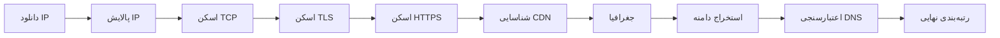

<div dir="rtl" align="center">

# ⚡ ARISHA MATRIX PIPELINE ⚡

<br>

[](https://t.me/aristapanel)
[](https://youtube.com/@aristaproject-m3o?si)
[](https://matrix.to/#/%23aristaproject:matrix.org)
[](https://arista-panel.arista-panel.workers.dev/)

<br>
<br>

---

</div>

<div dir="rtl">

## 📌 معرفی پروژه

**ARISTA MATRIX PIPELINE** یک سیستم پیشرفته و بهینه‌شده برای اسکن، شناسایی و رتبه‌بندی سرورهای Proxy و CDN است. این پروژه با استفاده از معماری Pipeline، به صورت مرحله‌ای IP‌ها را از منابع مختلف جمع‌آوری، پالایش، اسکن و نهایتاً بهترین سرورها را بر اساس معیارهای متعدد رتبه‌بندی می‌کند.

---

## 🚀 امکانات کلیدی

| ویژگی | توضیح |
|-------|-------|
| **پایپلاین چندمرحله‌ای** | اجرای مرحله‌به‌مرحله TCP → TLS → HTTPS → Fingerprint → GEO |
| **اسکن هم‌زمان** | استفاده از ThreadPoolExecutor برای اسکن سریع میلیون‌ها IP |
| **حافظه‌ی کش هوشمند** | ذخیره‌سازی نتایج اسکن برای جلوگیری از اسکن مجدد |
| **شناسایی CDN** | تشخیص خودکار CDN از طریق Headerها، TLS و ASN |
| **جغرافیای IP** | دریافت اطلاعات کشور، شهر و ارائه‌دهنده از چندین منبع |
| **استخراج دامنه** | استخراج دامنه‌ها از گواهی SSL، ریدایرکت‌ها و محتوای HTML |
| **رتبه‌بندی هوشمند** | امتیازدهی بر اساس TTFB، قابلیت اطمینان، پروتکل و CDN |
| **پشتیبانی از GitHub Actions** | اجرای خودکار و دوره‌ای در GitHub |

---

## 🔄 جریان کاری (Pipeline)



### شرح مراحل:

#### ۱. دانلود (Downloader)
دانلود لیست IP از منابع مشخص شده در فایل پیکربندی

#### ۲. پالایش (Cleaner)
- حذف IPهای تکراری
- گسترش CIDRها به IPهای مجزا
- نمونه‌گیری از شبکه‌های بزرگ

#### ۳. اسکن TCP
- بررسی باز بودن پورت‌ها
- اندازه‌گیری تأخیر (Latency)
- ذخیره‌سازی نتایج در `tcp_live.txt`

#### ۴. اسکن TLS
- انجام دست دادن TLS با SNIهای مختلف
- دریافت گواهی SSL
- تشخیص ALPN (h2 / http/1.1)

#### ۵. اسکن HTTPS
- ارسال درخواست HTTP/HTTPS
- اندازه‌گیری TTFB
- محاسبه قابلیت اطمینان (Reliability)

#### ۶. شناسایی CDN
- بررسی Headerهای پاسخ
- تحلیل Issuer گواهی
- تشخیص از طریق ASN

#### ۷. جغرافیا (GEO)
دریافت اطلاعات از چندین منبع:
- ip-api.com
- ipwho.is
- ipapi.co
- freeipapi.com
- ipinfo.io
- و چندین منبع دیگر

#### ۸. استخراج دامنه
- از گواهی SSL (CN و SAN)
- از ریدایرکت‌ها
- از محتوای HTML
- از PTR (Reverse DNS)

#### ۹. اعتبارسنجی DNS
- بررسی وجود رکورد A برای دامنه‌ها
- حذف دامنه‌های نامعتبر

#### ۱۰. رتبه‌بندی نهایی
امتیازدهی بر اساس:
- TTFB (زمان پاسخ)
- قابلیت اطمینان
- پروتکل (h2 امتیاز بیشتر)
- تشخیص CDN معروف
- پورت‌های پایدار (443, 8443, ...)

---

## 🖥️ نصب و اجرا

### نصب وابستگی‌ها

```bash
pip install -r Arista/requirements.txt
```

### اجرای کامل

```bash
python Arista/main.py
```

### اجرای مرحله‌ای

```bash
# اسکن TCP
python Arista/main.py --tcp

# اسکن TLS
python Arista/main.py --tls

# اسکن HTTPS
python Arista/main.py --https

# شناسایی CDN
python Arista/main.py --fp

# دریافت جغرافیا
python Arista/main.py --geo

# نهایی‌سازی و رتبه‌بندی
python Arista/main.py --finalize
```

---

## 📁 خروجی‌ها

| فایل | توضیح |
|------|-------|
| `output/clean_ips.txt` | IPهای پالایش شده |
| `output/tcp_live.txt` | IPهای زنده TCP |
| `output/tls_live.txt` | IPهای دارای TLS |
| `output/https_live.txt` | IPهای پاسخ‌دهنده HTTPS |
| `output/fingerprint_results.txt` | نتایج شناسایی CDN |
| `output/results.txt` | نتایج نهایی با جغرافیا |
| `output/best_ips.txt` | رتبه‌بندی نهایی سرورها |
| `output/domains.txt` | دامنه‌های معتبر استخراج شده |
| `output/geo_cache.json` | کش اطلاعات جغرافیایی |
| `output/scanned_cache.txt` | کش IPهای اسکن شده |

### نمونه خروجی `best_ips.txt`:

```
[IP: 1.2.3.4] [PORT: 443] [SCORE=85] [TTFB=120ms] [PROTO=h2] [REL=0.95] [CDN=cloudflare] [TYPE=HTTPS] [DOMAIN=example.com] [SNI=cloudflare.com] [City=Tehran] [Country=Iran] [Provider=MTN]
```

---

## 🔧 GitHub Actions

پروژه از GitHub Actions برای اجرای خودکار و دوره‌ای پشتیبانی می‌کند:

```yaml
on:
  workflow_dispatch:
  schedule:
    - cron: "0 * * * *"  # هر ساعت یک بار
```

### مراحل اجرا در GitHub Actions:

1. **Prepare**: دانلود و پالایش IPها
2. **TCP**: اسکن TCP
3. **TLS**: اسکن TLS
4. **HTTPS**: اسکن HTTPS
5. **Fingerprint**: شناسایی CDN
6. **GEO**: دریافت جغرافیا
7. **Finalize**: رتبه‌بندی نهایی

---

## 📊 معیارهای رتبه‌بندی

### امتیاز TTFB

| محدوده (ms) | امتیاز |
|-------------|--------|
| ≤ 150 | ۴ |
| ≤ 300 | ۲ |
| ≤ 500 | ۱ |
| > 500 | ۰ |

### امتیاز CDN

| نوع | امتیاز |
|-----|--------|
| CDN معروف | ۲+ |
| ناشناس | ۰ |

### امتیاز پروتکل

| پروتکل | امتیاز |
|--------|--------|
| h2 | ۲+ |
| http/1.1 | ۰ |

### امتیاز قابلیت اطمینان

| درصد | امتیاز |
|-------|--------|
| ≥ 90% | ۳+ |
| < 90% | ۰ |

---

</div>

<div align="center">

❤️ **ساخته شده توسط تیم آریستا** (🇲‌🇲‌🇩‌) ❤️

---

## ⭐ حمایت

اگر این پروژه برای شما مفید بود، لطفاً با ⭐ در GitHub از ما حمایت کنید.

</div>
